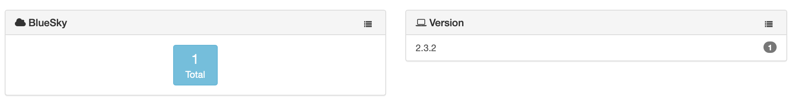

# BlueSky module

> v. 1.0.0 
> April 5, 2021  
> Alex Narvey / Precursor.ca  

Reports on BlueSky installs.
(see: https://github.com/sphen13/BlueSky)

Retrieves information from the preferences file /var/bluesky/preference.plist.

The following information is stored in the table:

* version - The BlueSky version

## Notes

An output file is only created if the preferences file exists in the /var/bluesky folder.
The output file is removed if the preferences file no longer exists so that new records will not be created.

## Updates

* April 5, 2021 Version 1.0 

## Contributors
* Alex Narvey

—
Alex Narvey
precursor.ca
